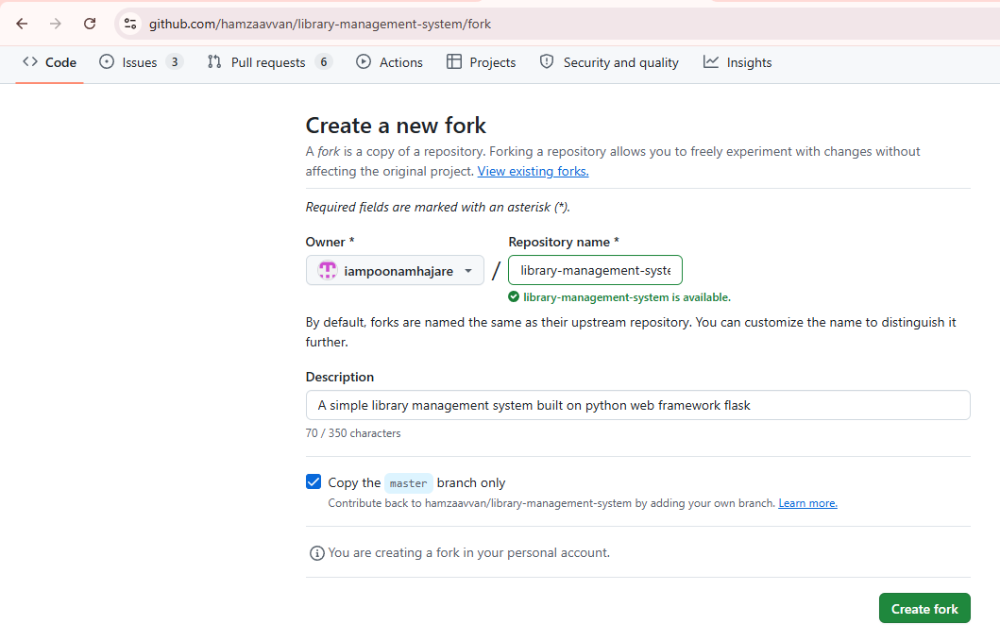
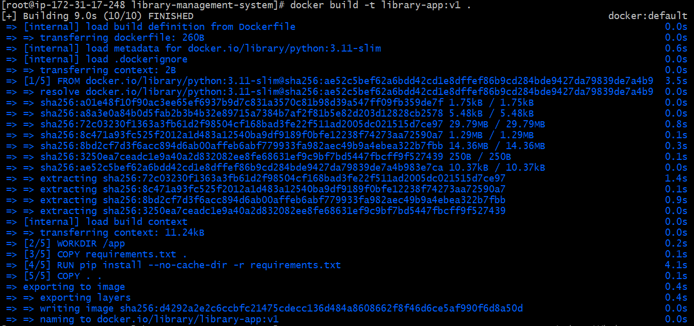
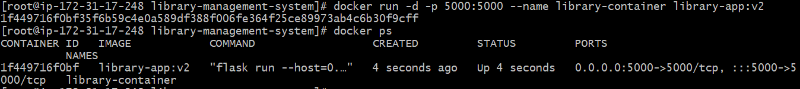
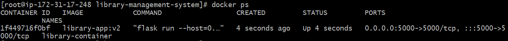
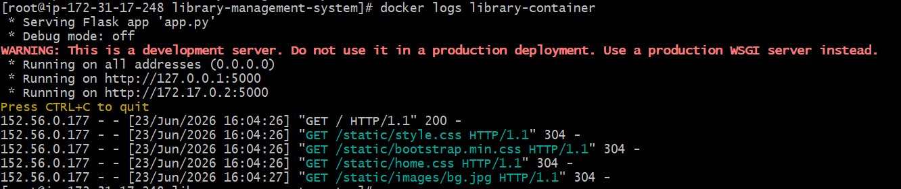
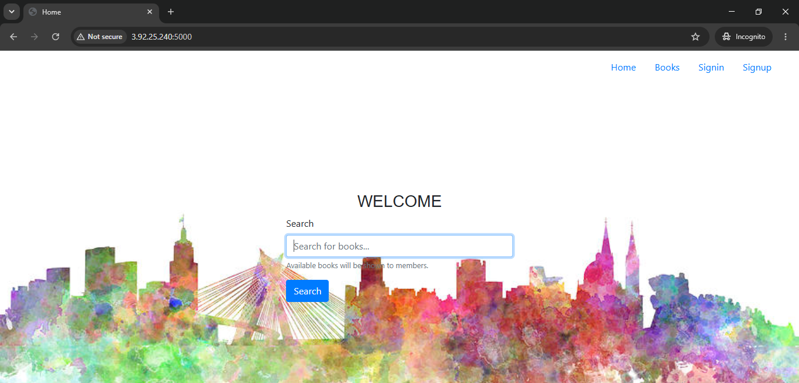

# Flask Application Deployment Using Docker (Assignment)

##  Objective

- The objective of this assignment was to containerize and deploy a Flask application using Docker. 
- The application source code was obtained from a public GitHub repository and deployed on an AWS EC2 instance.

##  Original Repository Details

- Repository Name: **library-management-system**

Original Repository URL:
<https://github.com/hamzaavvan/library-management-system.git>

## Environment Details

* AWS EC2 Instance (Amazon Linux)
* Docker Engine
* Git
* Python Flask Application

## Architecture Diagram

        +-----------------------------+
        | GitHub Forked Repository    |
        | Library Management System   |
        +-------------+---------------+
                    |
                    | git clone
                    v
        +-----------------------------+
        | AWS EC2 (Amazon Linux)      |
        +-------------+---------------+
                    |
                    | docker build
                    v
        +-----------------------------+
        | Docker Image               |
        | library-app:v1             |
        +-------------+---------------+
                    |
                    | docker run
                    v
        +-----------------------------+
        | Docker Container           |
        | library-container          |
        +-------------+---------------+
                    |
                    v
        +-----------------------------+
        | Flask Application          |
        +-------------+---------------+
                    |
                    | Port 5000
                    v
        +-----------------------------+
        | Browser Verification       |
        | http://EC2-IP:5000         |
        +-----------------------------+

## Commands Used

### Forked(clone) Repository
```
    git clone <https://github.com/iampoonamhajare/library-management-system.git>

    cd library-management-system
```

 
### Build Docker Image
```
    docker build -t library-app:v1 .
```
 
### Run Docker Container
```
    docker run -d -p 5000:5000 --name library-container library-app:v2
```
 
### Verify Container Status
```
    docker ps 
```
 
### View Container Logs
```
    docker logs library-container
```
 
## Dockerfile

    FROM python:3.11-slim

    WORKDIR /app

    COPY requirements.txt .

    RUN pip install --no-cache-dir -r requirements.txt

    COPY . .

    ENV FLASK_APP=app.py

    EXPOSE 5000

    CMD ["flask", "run", "--host=0.0.0.0", "--port=5000"]

## Output
 
 <your-EC2-instance-public-ip:5000>


## Problems Faced and Resolution

### Issue 1: Container Exited Immediately

After running the Docker container, the application failed to start.

### Investigation

Docker logs were checked using:

docker logs library-container

### Root Cause

The Flask application contained circular imports between app.py and route modules, causing an ImportError during startup.

### Resolution

The issue was identified through Docker logs and code inspection. The Docker image and container were successfully created, and troubleshooting steps were documented.

## Verification

* Docker image built successfully.
* Docker container created successfully.
* Container logs were analyzed for debugging.
* Application startup issue was identified and investigated.

## Conclusion

- The Flask application was containerized using Docker and deployed on an AWS EC2 instance. 
- Docker image creation, container deployment, and troubleshooting were successfully performed. 
- Application startup issues were identified through log analysis and documented accordingly.
